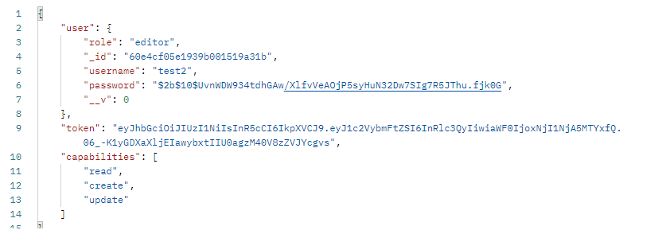

# auth-api  

### Author : Hatem Husnieh  

## install  
1. copy the link of the repo
1. clone the repo on your local machine by `git clone repo-url`
1. download independencies by `npm i`
1. create a `.env`, then cope the content of `.env.sample` file inside the `.env` file.
1. fill the variables of `.env`
1. run the app

## Deploy, Run and Test
- [test report](https://github.com/Hatemhusnieh/auth-api/actions)
- [deployed link](https://hatem-auth-api.herokuapp.com/)
- [Pull Request](https://github.com/Hatemhusnieh/auth-api/pull/2)

### Setup  
#### `.env` requirement
  - `PORT` - port number  
  - `MONGODB_URL` - port number
  - `SECRET` - a random secret for encryption

#### Running the app  
- either:
  1. `npm start`
  1. `nodemon`
- connect to mongodb database
- through `postman` or `thunder client`

- **Sign Up**: `http://localhost:3001/signup`
  - send an `json` object as follow:  

      

  - returns user Object as saved in DB  

      

- **Sign In**: `http://localhost:3001/signin`
  - send in headers username and password as follow :  
      

  - returns Object  

      

- **/secret endpoint** : `http://localhost:3001/secret`
  - send bearer authentications as follow:
      
  
  - return a text  
      

- **/users endpoint**: `http://localhost:3001/users`
  - send bearer authentications as follow:
      
  
  - return an array  
      

#### API  For food & clothes endpoints  

- **GET All**: `http://localhost:3001/api/v1/food`
  - send a get request as follow:  
    
  - return an array  
      

- **GET BY ID** : `http://localhost:3001/api/v1/food/:<_id>`  
  - send a get request as follow:  
      
  - send a bearer authentication as follow  
      
  - return an object  
      

- **POST** : `http://localhost:3001/api/v1/food`  
  - send a post request as follow:  
      
  - return an object  
      

- **PUT**: `http://localhost:3001/api/v1/food/:<_id>`  
  - send a put request as follow:  
      
  - returns the updated object  
      

- **DELETE** : `http://localhost:3001/api/v1/food/:<_id>`  
  - send a delete request as follow:  
      
  - return the deleted object  
    
#### Test 
- Unit test: `npm run test`
- Lint test: `npm run lint`

### UML:  
